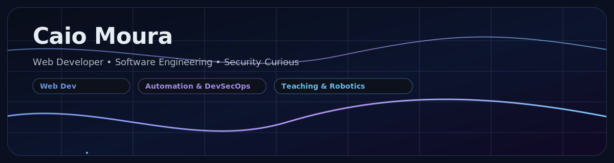

<!-- ================= HEADER ================= -->

  

<!-- ================= TYPING ================= -->

  

<!-- ================= BADGES ================= -->

  
  
  

---

## 🧠 About

Desenvolvedor focado em **Web & Software Engineering**.  
Construo aplicações com organização, clareza estrutural e mentalidade de longo prazo.

- 💻 Front & Back-end Web
- 🧱 Modelagem e organização de código
- 🛡️ Interesse consistente em Security / DevSecOps
- 🤖 Projetos educacionais e robótica
- 🎵 Músico multi-instrumentista (Nem só de terminal vive o Dev)
- 🌍 PT-BR | ES | EN | FR | RU

---

## 🚀 Currently Building

- Evolução da plataforma **Estudos de Russo**
- Refinando projetos com foco em arquitetura e manutenibilidade
- Aprofundando práticas de segurança e validação

---

## 🧰 Tech Stack

  

---

## 🧩 Featured Projects

---

## 📊 GitHub Metrics

 

---

## 🧠 Engineering Mindset

- Código limpo > código esperto  
- Estrutura antes de otimização  
- Segurança como prática, não como remendo  
- Aprendizado contínuo aplicado na prática  

---

## 🤝 Contato

Se você curte gente que aprende rápido, entrega e não romantiza gambiarra, alguém técnico, didático e orientado a solução: **bora trocar uma ideia.**
